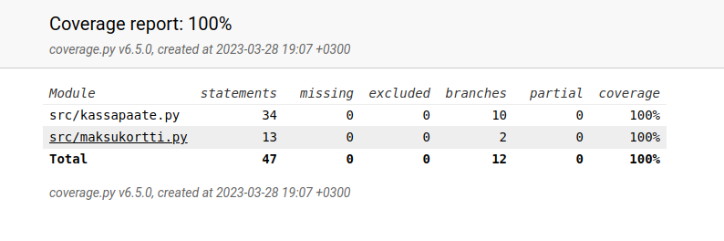

# TKT20002 Ohjelmistotekniikka
Harjoitustyölle ja laskareille varattu git-repositorio.
 
This repository contains weekly excercises as well as the main project files for University of Helsinki's **TKT20002 Software Development Methods**.

## Tehtävät
### Viikko 1
- [gitlog.txt](laskarit/viikko1/gitlog.txt)
- [komentorivi.txt](laskarit/viikko1/komentorivi.txt)

## Viikko 2
- Coveragen generoima raportti:
 

- [Sovelluksen vaatimusmäärittely](docs/VAATIMUSMAARITTELY.md)
- [Tuntikirjanpito](docs/TUNTIKIRJANPITO.md)
