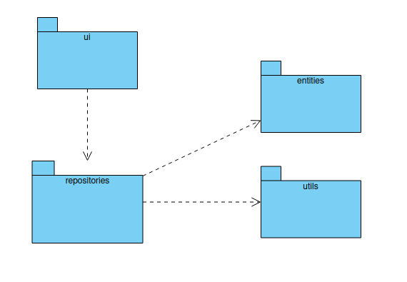
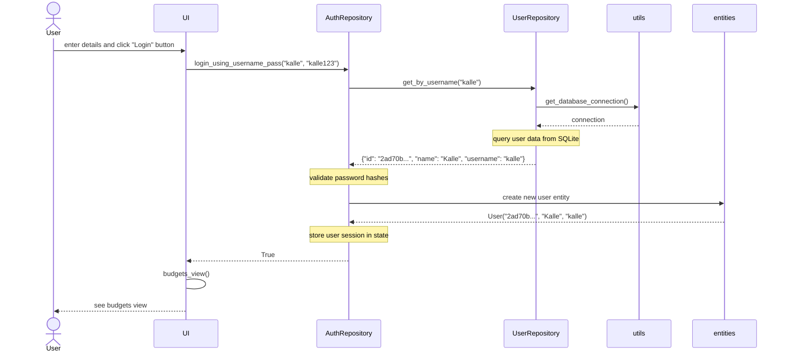
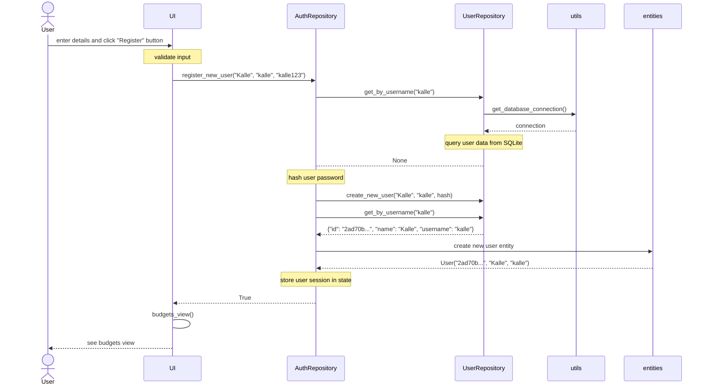

# Sovelluksen arkkitehtuurikuvaus
Rakenteessa noudatetaan kaksitasoista kerrosarkkitehtuuria ja sovelluksen pakkausrakenne on seuraava:

## Hakemistojen kuvaukset
- `data`- Sisältää tietokantaan liittyvät tiedostot
- `src`- Sisältää sovelluksen lähdekoodin
  - `entities`- Sisältää yleisesti käytettyjä olioita, jotka kuvastavat sovelluksen tietorakenteita
  - `repositories`- Sisältää repositoriot, joiden kautta käyttöliittymä muokkaa ja hakee dataa 
  - `tests`- Sisältää sovelluksen automaattiset yksikkötestit
  - `utils`- Sisältää "apuvälineitä" eli metodeja joita käytetään useasti ja monesta moduulista
  - `views`- Sisältää käyttöliittymänäkymät

## Päätoiminnallisuudet

Kuvataan seuraavaksi sovelluksen toimintalogiikka muutaman päätoiminnallisuuden osalta sekvenssikaaviona.

### Käyttäjän sisäänkirjautuminen
Kun *Kirjaudu*-näkymän syötekenttiin kirjoitetaan tietokannassa oleva käyttäjätunnus ja salasana ja painetaan "Kirjaudu", etenee kontrolli seuraavasti:

Jos käyttäjätunnus tai salasana ovat väärin, sovellus palauttaa käyttäjäystävällisen virheviestin.

### Käyttäjän rekisteröinti
Kun *Rekisteröidy*-näkymän syötekenttiin kirjoitetaan uniikin käyttäjän tiedot ja painetaan "Rekisteröidy", etenee kontrolli seuraavasti:

Jos käyttäjätunnus on olemassa tai salasana ja sen vahvistus eivät täsmää, sovellus palauttaa käyttäjäystävällisen virheviestin.

## Ohjelman rakenteeseen jääneet heikkoudet

Tällä hetkellä sovelluksella ei ole käytössä ns. service-luokkia, vaan esimerkiksi syötteen validointi tapahtuu käyttöliittymässä. Tällä ei kuitenkaan ole mielestäni suurta haittavaikutusta, sillä syötteet ovat pieniä ja tietokannan skeema on asianmukaisesti konfiguroitu väärien syötteiden varalta.