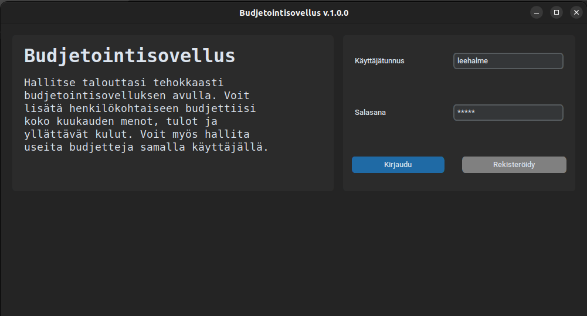
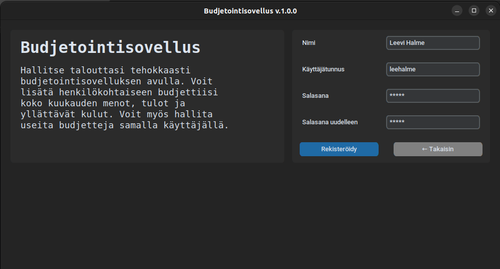
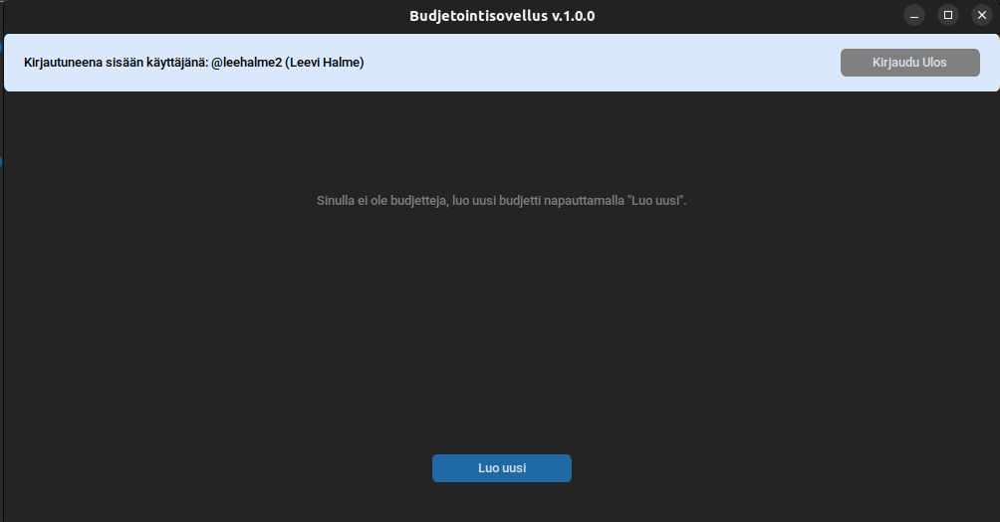
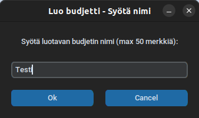
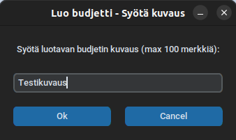
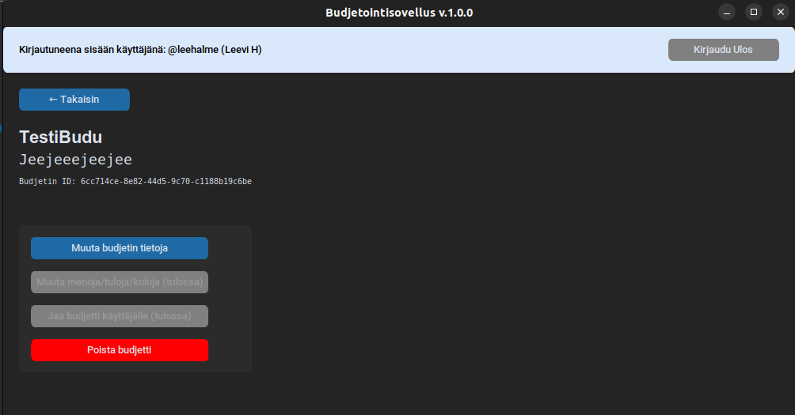

# Sovelluksen käyttöohje

## Konfigurointi
TBA...

## Ohjelman käynnistäminen
TBA...

## Kirjautuminen
*Kirjaudu sisään*-näkymästä on mahdollista siirtyä *Rekisteröidy*-näkymään painamalla "Rekisteröidy" painiketta.
Voit kirjautua sisään syöttämällä käyttäjätunnuksesi ja salasanasi syötekenttiin ja painamalla "Kirjaudu"-painiketta. 

Jos kirjautuminen onnistuu, ohjataan käyttäjä *Päänäkymään*.

## Rekisteröinti
Voit luoda uuden käyttäjän syöttämällä omat tietosi syötekenttiin ja painamalla "Rekisteröidy"

Jos rekisteröinti onnistuu, voit kirjautua sisään painamalla ensin "Takaisin", jonka jälkeen noudattamalla ylempänä kuvattuja askelia.

## Budjetin lisäys
Voit lisätä uuden budjetin päänäkymässä painamalla "Luo uusi" painiketta.

Tämän jälkeen vastaa kahteen kysymyslaatikkoon budjetin tiedoista

## Budjetin muokkaus
Voit muokata olemassa olevan budjetin tietoja valitsemalla se ensin *Päänäkymästä* painamalla "Avaa" painiketta. Tämän jälkeen voit muokata budjettia painamalla "Muuta budjetin tietoja".

Tämän jälkeen avautuu kaksi kysymyslaatikkoa, joihin voit kirjoittaa budjetin uudet tiedot (ks. "Budjetin lisäys")

## Uloskirjautuminen
Voit kirjautua ulos milloin tahansa painamalla vasemmassa yläkulmassa olevaa "Kirjaudu ulos" painiketta.