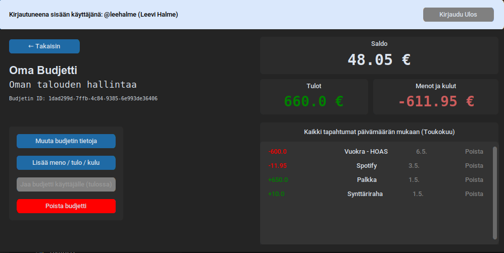
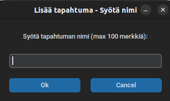
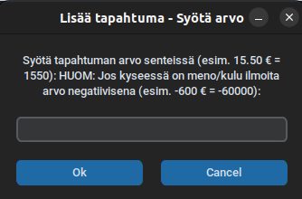
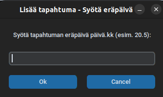

# Sovelluksen käyttöohje

Aloita lataamalla sovelluksen viimeisimmän releasen lähdekoodi linkistä [Latest Release](https://github.com/LeeviHalme/ot-harjoitustyo/releases/latest). 

## Ohjelman käynnistäminen
Siirry projektihakemistoon
```bash
cd budget-manager
```

Asenna riippuvuudet
```bash
poetry install
```

Alusta tietokanta
```bash
poetry run invoke init-db
```

Käynnistä sovellus
```bash
poetry run invoke start
```

## Kirjautuminen
*Kirjaudu sisään*-näkymästä on mahdollista siirtyä *Rekisteröidy*-näkymään painamalla "Rekisteröidy" painiketta.
Voit kirjautua sisään syöttämällä käyttäjätunnuksesi ja salasanasi syötekenttiin ja painamalla "Kirjaudu"-painiketta. 


Jos kirjautuminen onnistuu, ohjataan käyttäjä *Päänäkymään*.

## Rekisteröinti
Voit luoda uuden käyttäjän syöttämällä omat tietosi syötekenttiin ja painamalla "Rekisteröidy"


Jos rekisteröinti onnistuu, voit kirjautua sisään painamalla ensin "Takaisin", jonka jälkeen noudattamalla ylempänä kuvattuja askelia.

## Budjetin lisäys
Voit lisätä uuden budjetin päänäkymässä painamalla "Luo uusi" painiketta.


Tämän jälkeen vastaa kahteen kysymyslaatikkoon budjetin tiedoista


## Budjetin muokkaus
Voit muokata olemassa olevan budjetin tietoja valitsemalla se ensin *Päänäkymästä* painamalla "Avaa" painiketta. Tämän jälkeen voit muokata budjettia painamalla "Muuta budjetin tietoja".


Tämän jälkeen avautuu kaksi kysymyslaatikkoa, joihin voit kirjoittaa budjetin uudet tiedot (ks. "Budjetin lisäys")

## Tapahtumien lisäys
Voit lisätä uuden tapahtuman valitsemalla ensin budjetin tarkasteltavaksi ja painamalla "Lisää meno / tulo / kulu". Tämän jälkeen avautuu kaksi kysymyslaatikkoa, joihin voit kirjoittaa tapahtuman tiedot.



**HUOM:** Syötä tiedot pyydetyssä muodossa, muuten tapahtuman luonti epäonnistuu.





## Uloskirjautuminen
Voit kirjautua ulos milloin tahansa painamalla vasemmassa yläkulmassa olevaa "Kirjaudu ulos" painiketta.