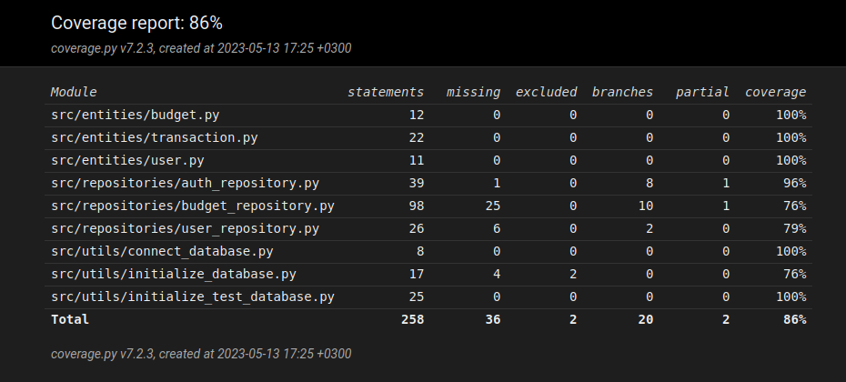

# Testausdokumentti

Ohjelmistoa testataan automatisoiduin yksikkö -ja integraatiotestein unittestillä, sekä manuaalisesti käyttöliittymästä.

## Yksikkö- ja integraatiotestaus

### Sovelluslogiikka

Sovelluslogiikasta vastaavia luokkia (repositoriot, muotoa `XRepository.py`) testataan `tests/test_x_repository.py` luokilla. Riippuen repositoriosta, testien alussa saatetaan injektoida tietokantaan testien vaatimaa tietoa. **Testit käyttävät muusta sovelluksesta irrallaan olevaa `test_database.sqlite`-tietokantaa**

### Testauskattavuus

Käyttöliittymäkerrosta lukuunottamatta sovelluksen testauksen haarautumakattavuus on 86%

Testaamatta jäivät tilanteet, joissa tietokanta tai SQL-kysely itsessään palauttaa virheen.

## Järjestelmätestaus

Sovellusta on järjestelmätestattu manuaalisesti.

### Asennus ja konfigurointi

Sovellus on haettu ja sitä on testattu [käyttöohjeen](./kayttoohje.md) kuvaamalla tavalla Linux-ympäristöön.

Sovellusta on testattu sekä tilanteissa, joissa käyttäjät, budjetit ja tapahtumat ovat olleet olemassa, sekä tilanteissa, joissa niitä ei ole ollut jolloin ohjelma on luonut ne itse.

### Toiminnallisuudet

Kaikki [määrittelydokumentin](VAATIMUSMAARITTELY.md) ja käyttöohjeen listaamat toiminnallisuudet on käyty läpi. Kaikkien toiminnallisuuksien yhteydessä on syötteenä yritetty käyttää myös virheellisiä arvoja, esim. tyhjiä arvoja.

## Sovellukseen jääneet laatuongelmat

Sovellus ei anna tällä hetkellä järkeviä virheilmoituksia, seuraavissa tilanteissa:

- SQLite tietokantaa ei ole alustettu, eli `poetry run invoke init-db`-komentoa ei ole suoritettu
- Tietokanta on korruptoitunut tai sovelluksen sisäiset SQL-kyselyt ovat virheellisiä