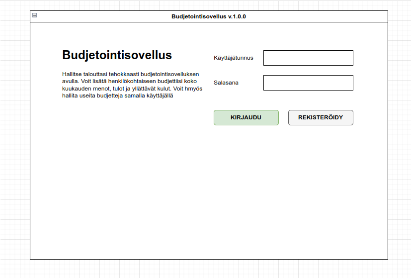
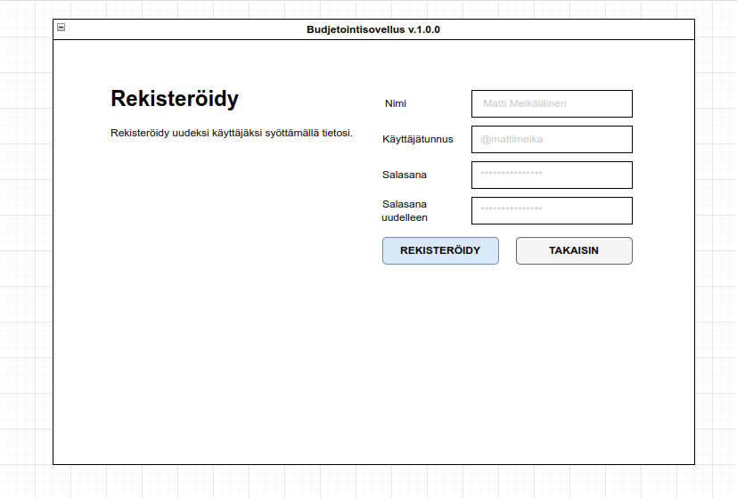
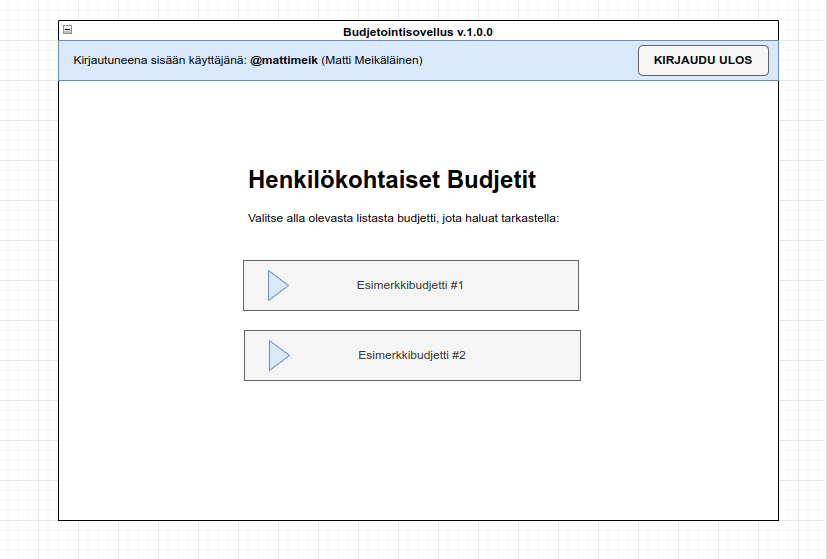
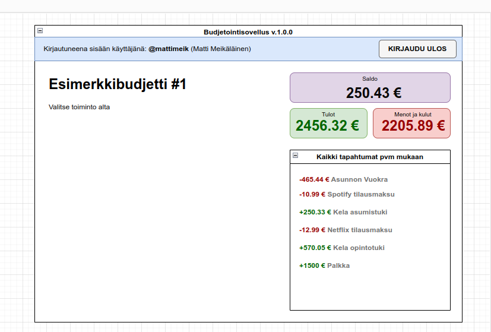

# Vaatimusmäärittely

## Sovelluksen tarkoitus

Kyseessä on budjetointisovellus, jonka avulla käyttäjät pystyvät hallitsemaan talouttaan tehokkaammin. Sovellusta on mahdollista käyttää kirjautumalla sisään, jolloin luotuja budjetteja pystyy tallentamaan tietokantaan ja näin katsoa, sekä muokata niitä jälkeenpäin. Budjetit ovat henkilökohtaisia ja ovat katsottavissa vain kirjautuneena käyttäjänä.

## Käyttäjät ja roolit
Perustoiminnallisuuksiin kuuluu ainoastaan yksi käyttäjäryhmä (rooli), joka on **tavallinen käyttäjä**. Kehitysideana on tuoda myöhemmin mahdollisuus jakaa omia budjettejaan toisten käyttäjien kanssa, mutta siihen ei tarvitse luoda uusia rooleja.

## Käyttöliittymäluonnos
### Kirjaudu sisään __(valmis)__
Sovelluksen perustoiminnallisuuksiin kuuluu kolme eri käyttöliittymänäkymää. Ensimmäinen *kirjaudu sisään* näyttö on *rekisteröidy* näytön kanssa ainoat, mitkä näkyvät kirjautumattomalle käyttäjälle.
 

### Rekisteröidy __(valmis)__
Seuraava näyttö mahdollistaa uuden käyttäjän luonnin.
 

### Päänäkymä __(valmis)__
Mahdollistaa budjettien nopean katsauksen, sekä siirtymän muihin budjettinäkymiin.

### Budjettinäkymät
- Näytä budjetti
- Muokkaa budjettia (lisää kuluja, menoja ja tuloja)

## Perusversion tarjoama toiminnallisuus
Sovelluksen perusversio tarjoaa yksinkertaiset työkalut talouden hallintaan. Tätä listaa voidaan päivittää, jos sovelluksen perustoiminnallisuudet vaikuttavat tyngiltä.
 
### Ennen kirjautumista
- [x] Käyttäjä voi rekisteröityä ja luoda sovellukseen uuden käyttäjän.
  - [x] Käyttäjätunnus ja salasana validoidaan ennen luontia. 
    - [x] Validointisäännöt:
      - Samalla käyttäjätunnuksella ei voi olla kuin yksi käyttäjä
      - Lisätään sääntöjä tarvittaessa
### Kirjautumisen jälkeen
- [x] Käyttäjä näkee omat budjettinsa
  - [x] Käyttäjä pystyy lisäämään uuden budjetin
- [x] Käyttäjä voi valita tarkasteltavaksi yksittäisen budjetin
  - [x] Käyttäjä pystyy muokata aiemmin luotua budjettia
    - [ ] Menojen, kulujen ja tulojen muokkaus
  - [ ] Käyttäjä pystyy poistamaan budjetin
  - [x] Käyttäjä näkee yksityiskohtaisen raportin budjetista
    - [ ] Yksinkertainen lista kaikista tapahtumista

### Jatkokehitysideoita
Kun perustoiminnallisuudet ovat valmiita, aletaan jatkokehittämään sovellusta. Suunniteltuja ominaisuuksia ovat muun muassa (lista päivittyy):
- Budjettien jakaminen muiden käyttäjien kanssa
- Parempi raportointinäkymä (kaavioita, muita tilastotyökaluja tms.)
- Budjetin exporttaaminen esimerkisi CSV-, tai JSON-muodossa
- Käyttäjän tietojen muokkaaminen ja siihen sopiva käyttöliittymä-näkymä
- Budjettitapahtumien kategorointi ja siihen liittyvät tilastointi-ominaisuudet
- **Lista päivittyy...**