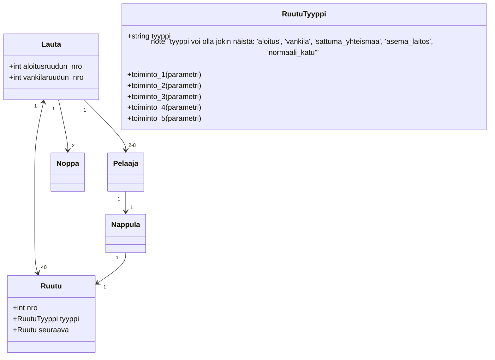

# Tehtävä 1: Monopoli

```mermaid
classDiagram
  Lauta "1" --> "2-8" Pelaaja
  Pelaaja "1" --> "1" Nappula
  Lauta "1" --> "2" Noppa
  Lauta "1" <--> "40" Ruutu
  Nappula "1" --> "1" Ruutu
  class Lauta {
    +int aloitusruudun_nro
    +int vankilaruudun_nro
  }
  class Ruutu {
    +int nro
    +RuutuTyyppi tyyppi
    +Ruutu seuraava
  }
  class RuutuTyyppi {
    +string tyyppi
    note "tyyppi voi olla jokin näistä: 'aloitus', 'vankila', 'sattuma_yhteismaa', 'asema_laitos', 'normaali_katu'"
    +toiminto_1(parametri)
    +toiminto_2(parametri)
    +toiminto_3(parametri)
    +toiminto_4(parametri)
    +toiminto_5(parametri)
  }
```