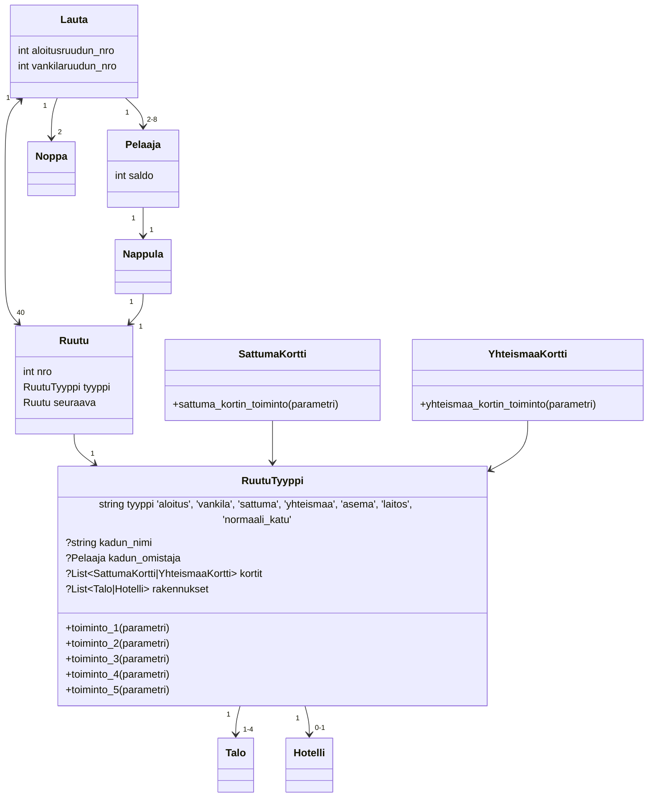

# Tehtävä 1: Monopoli

```mermaid
classDiagram
  Lauta "1" --> "2-8" Pelaaja
  Pelaaja "1" --> "1" Nappula
  Lauta "1" --> "2" Noppa
  Lauta "1" <--> "40" Ruutu
  Nappula "1" --> "1" Ruutu
  Ruutu --> "1" RuutuTyyppi
  RuutuTyyppi "1" --> "1-4" Talo
  RuutuTyyppi "1" --> "0-1" Hotelli
  SattumaKortti --> RuutuTyyppi
  YhteismaaKortti --> RuutuTyyppi
  

  class Pelaaja {
    int saldo
  }
  class Lauta {
    int aloitusruudun_nro
    int vankilaruudun_nro
  }
  class Ruutu {
    int nro
    RuutuTyyppi tyyppi
    Ruutu seuraava
  }
  class RuutuTyyppi {
    string tyyppi 'aloitus', 'vankila', 'sattuma', 'yhteismaa', 'asema', 'laitos', 'normaali_katu'
    ?string kadun_nimi
    ?Pelaaja kadun_omistaja
    ?List~SattumaKortti|YhteismaaKortti~ kortit
    ?List~Talo|Hotelli~ rakennukset

    +toiminto_1(parametri)
    +toiminto_2(parametri)
    +toiminto_3(parametri)
    +toiminto_4(parametri)
    +toiminto_5(parametri)
  }
  class SattumaKortti {
    +sattuma_kortin_toiminto(parametri)
  }
  class YhteismaaKortti {
    +yhteismaa_kortin_toiminto(parametri)
  }
```